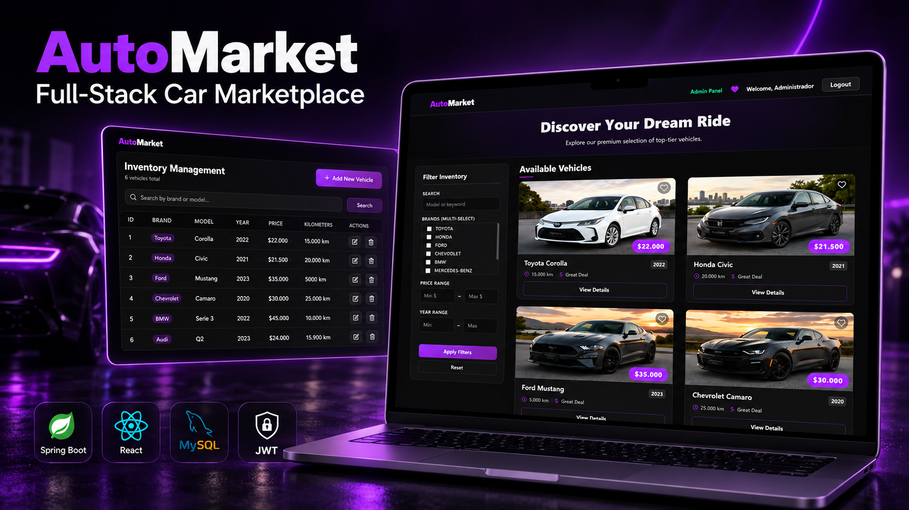
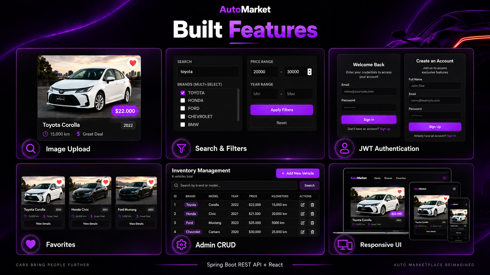

<div align="center">

# AutoMarket — Car Marketplace

A full-stack vehicle marketplace built with Spring Boot and React.

Users can explore and filter vehicles, open detailed listings, manage favourites and authenticate securely. Administrators have a protected panel for complete inventory management.


</div>



## What the application does

AutoMarket covers the main flow of a real marketplace: public catalogue browsing, authenticated user actions and role-protected administration.

- Vehicle catalogue with text search, filters, sorting and pagination
- Detailed vehicle pages
- Registration and login with JWT authentication
- User and administrator roles
- Personal favourites
- Administrator CRUD for vehicle inventory
- Image URLs and local image uploads
- Request validation and centralised error handling
- Seed data for immediate testing
- Responsive interface with loading states, notifications and dedicated 401, 403 and 404 handling



## Technology stack

| Area | Technologies |
| --- | --- |
| Backend | Java 17, Spring Boot, Spring MVC |
| Security | Spring Security, JWT |
| Data | Spring Data JPA, Hibernate, MySQL |
| API | REST, Bean Validation, OpenAPI / Swagger |
| Frontend | React 19, React Router, Vite |
| Testing | JUnit, Mockito, H2, Maven |
| Tools | Git, GitHub, Postman |

## Architecture

```text
React client
    |
    | HTTP / JSON + JWT
    v
Spring Boot REST API
    |
    | JPA / Hibernate
    v
MySQL database
```

The backend follows a layered structure with controllers, services, repositories, DTOs, entities and a dedicated security layer.

## Run locally

### Requirements

- Java 17
- Node.js and npm
- MySQL

### 1. Clone the repository

```bash
git clone https://github.com/JorgeJLCode/car-marketplace-app.git
cd car-marketplace-app
```

### 2. Configure the database

Create a MySQL database or allow the application to create `carsales_db`. Configure these environment variables when needed:

```env
DB_URL=jdbc:mysql://localhost:3306/carsales_db
DB_USER=your_user
DB_PASSWORD=your_password
JWT_SECRET=your_secure_secret
```

### 3. Start the backend

```bash
cd car-sales
./mvnw spring-boot:run
```

On Windows:

```powershell
cd car-sales
.\mvnw.cmd spring-boot:run
```

### 4. Start the frontend

Open a second terminal:

```bash
cd frontend
npm install
npm run dev
```

Vite will display the local frontend address in the terminal.

## API documentation

With the backend running, Swagger UI is available at:

```text
http://localhost:8080/swagger-ui/index.html
```

The API includes endpoints for authentication, vehicles, favourites and image uploads. Administrative vehicle operations require the administrator role.

## Tests

Run the backend test suite with:

```bash
cd car-sales
./mvnw test
```

The test setup uses JUnit, Mockito and an H2 test database.

## Project status

The portfolio MVP is complete. It demonstrates full-stack development, REST API design, JWT security, role-based authorisation, relational data modelling, validation, testing and responsive frontend development.

## Author

**Jorge Luques Astorga**  
Full-Stack Junior Developer

[GitHub profile](https://github.com/JorgeJLCode)
